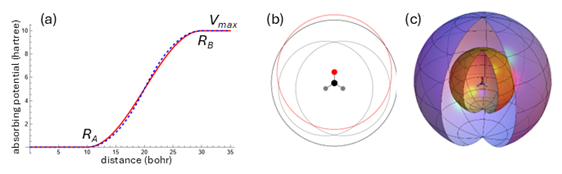
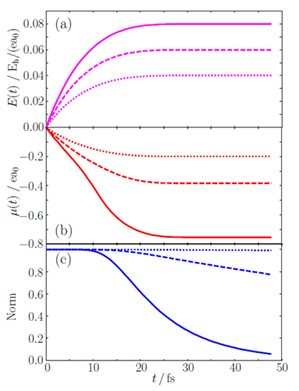

## Theoretical Background

The time-dependent configuration interaction (TDCI) code can be used to simulate the electronic structure of a molecule interacting with the electric field of an intense, ultra-short laser pulse.
The time-independent, ground and excited configurations of a molecule in the absence of a field are combined with time-dependent linear coefficients to model the molecular wavefunction in the electric field of the laser pulse (the nuclear positions kept fixed).
The interaction of the molecule with the electric field of the laser pulse is treated in the semiclassical dipole approximation and the pulses can be linear or elliptically polarized.
For strong field ionization, the molecule is surrounded by a complex absorbing potential (CAP) to remove the outgoing electron (see Figure 1).


***Figure 1.** Hydrogen atom wavefunction (light blue), Coulomb potential (dark blue) and complex absorbing potential (dashed dark blue) without a field. The strong field from a laser pulse suppresses the Coulomb potential (red) and the wavefunction (orange) can go over the Coulomb barrier or tunnel through it and be absorbed by the complex potential (dashed red).*

For single ionization, the wavefunction includes the Hartree-Fock ground state and all singly excited configurations (CIS).[^1][^2]
Ionization of cations can be modeled by a CISD-IP wavefunction which is built from singly ionized and singly excited, singly ionized configurations of the Hartree-Fock ground state of the neutral molecule.
For molecules with heavy elements, spin-orbit coupling (SOC) can be included with an effective one electron SOC operator.[^5]
The wavefunction is propagated with the exponential of the field-dependent Hamiltonian using a Trotter factorization.
The ionization yield for TDCI-CAP simulation is calculated from the decrease in the norm squared of the wavefunction as it interacts with the absorbing potential.
The rate is computed from the expectation value of the absorbing potential using the time-dependent wavefunction.
The integrals needed to construct the Hamiltonian are computed in an electronic structure program such as Gaussian.
For strong field ionization standard molecular basis sets are augmented with several sets of diffuse functions to support the wavefunction as the electron leaves the molecule and interacts with the absorbing potential.
The followings sections provide a brief overview of the theory and computational approaches of the TDCI code.
More details on applications can be found in some of our papers.[^3][^4][^6][^7]

### Hamiltonian 
In the TD-CI approach, the electronic wavefunction is propagated with the time dependent Schrödinger equation.
```math
i\hbar \frac{\partial}{\partial t} \Psi(t) = \hat{H}(t)\Psi(t) = \left[\hat{H}_{el} + \hat{V}^{SOC} - \hat{\vec{\mu}} \cdot \vec{E}(t) - i \hat{V}^{abs}\right] \Psi(t) \tag{1}
```

$\hat{H}_{el}$ is the field-free, time-independent non-relativistic electronic Hamiltonian and the interaction with the electric field of an intense laser pulse is treated in the semiclassical dipole approximation, where $\hat{\vec{\mu}}$ is the dipole operator and $\vec{E}$ is the electric field.
The spin-orbit coupling term is approximated by an effective one electron spin-orbit coupling operator. 

```math
\hat{V}^{SOC} = -\frac{\alpha_0^2}{2} \sum_A Z_A^{eff} \frac{(\vec{r} - \vec{r}_A) \times \nabla}{|\vec{r} - \vec{r}_A|^3} \tag{2}
```

Suitable values for $Z^{eff}$ have been reported by Koseki, Gordon and co-workers and by Chiodo and Russo.
$Z^{eff}$ can be adjusted to reproduce the experimentally observed spin-orbit splitting.
$\hat{V}^{abs}$  is the absorbing potential.

### Absorbing Potential
The absorbing potential, $\hat{V}^{abs}$, surrounds the molecule starting at a distance of about 10 – 15 bohr and removes the outgoing part of the wavefunction thereby simulating ionization.
The absorbing potential for the molecule is constructed from spherical potentials centered on each atom.
The potential on atom C is written in terms of the distance from the nucleus, ${r_{c}=\left|\vec{r} - \vec{C}\right|}$ .
In the quadratic form, the atomic potential starts at $R_A$ rises quadratically to $(R_A+R_B)/2$, turns over quadratically to $R_B$ and is constant, $V_{max}$, beyond $R_B$. 
```math
\hat{V}^{abs}_{C}(r_c) =
\begin{cases} 
0, & r_c \leq R_A, \\
V_{max}, & r_c \geq R_B, \\
2V_{max} \left( \frac{r_c - R_A}{R_B - R_A} \right)^2, & R_A \leq r_c \leq \frac{R_A + R_B}{2}, \\
V_{max} - 2V_{max} \left( \frac{R_B - r_c}{R_B - R_A} \right)^2, & \frac{R_A + R_B}{2} \leq r_c \leq R_B.
\end{cases}
\tag{3}
```
In the $sin^2$ form, the atomic potential on an atom rises as $\sin^2$ between $R_A$ and $R_B$,
```math
\hat{V}^{abs}_{C}(r_c) = V_{max} \sin^2 \left( \frac{\pi}{2} \frac{r_c - R_A}{R_B - R_A} \right), \quad R_A \leq r_c \leq R_B.
\tag{4}
```
The absorbing potential for the molecule is equal to the minimum of the values of the atomic absorbing potentials. This has also been termed a Voronoi absorbing potential. 
```math
\hat{V}^{abs}(\vec{r}) = \min\left( \hat{V}^{abs}_1, \hat{V}^{abs}_2, \dots, \hat{V}^{abs}_{\text{Natoms}} \right).
\tag{5}
```

Typical values of the parameters for the absorbing potential are $R_A = 3.5$ times the van der Waals radius for each atom (so that the absorbing potential starts far enough beyond the Coulomb well), $R_B = 10$ times the van der Waals radius (so that the rise in the absorbing potential is gradual enough to minimize any reflection) and $V_{\text{max}} = 10$ hartree (so that the potential is strongly absorbing but the integrals remain finite). Figure 2 shows examples of atomic and molecular absorbing potentials.


***Figure 2.** (a) Shape of an atomic absorbing potential ($\sin^2$ form in red, quadratic form in dashed blue), (b) 2D plot of $R_A$ for absorbing potential of carbon (black), oxygen (red) and hydrogen (grey) in $CH_2O$ (c) 3D plot of RA (gold) and $(R_A+R_B)/2$ (blue) for the molecular absorbing potential for $CH_2O$.*

### Electric Field of Laser Pulse
The electric field for linearly polarized $n$ cycle pulse with a $\sin^2$ envelope is,
```math
E(t) =
\begin{cases}
E_{max} \sin^2\left(\frac{\omega t}{2n}\right) \cos(\omega t), & 0 \leq t \leq 2n \\
0, & t > 2n.
\end{cases}
```
and an $n$ cycle circular polarized 800 nm pulse in the $xz$ plane with a $\sin^2$ envelope.
For an \(n\) cycle circularly polarized 800 nm pulse in the \(xz\)-plane with a \(\sin^2\) envelope:

```math
E_x(t) = E_{max} \sin^2\left(\frac{\omega t}{2n}\right) \big[-\cos(\omega t)\cos(\gamma) - \sin(\omega t)\sin(\gamma)\big],
```
```math
E_z(t) = E_{max} \sin^2\left(\frac{\omega t}{2n}\right) \big[\cos(\omega t)\sin(\gamma) - \sin(\omega t)\cos(\gamma)\big],
```
```math
E_x(t) = E_z(t) = 0, \quad t \geq 2n.
\tag{7}
```
$E_{max}$ is the maximum value for the electric field and $\gamma$ is the Euler angle that determines the direction of the major axis of an elliptically polarized pulse.
To obtain directional information for ionization, a static field can be used instead of an oscillating field.
To avoid non-adiabatic excitations, the electric field is slowly ramped up to a constant value. 
```math
\begin{cases}
E(t) = E_{max} \left(1 - \left(1 - \frac{t}{t_{ramp}}\right)^4\right) & 0 \leq t \leq t_{ramp} \\
E(t) = E_{max} & t > t_{ramp}.
\end{cases}
\tag{8}
```
The shapes of a 7 cycle linear pulse and a static pulse are shown in Figure 3.
Several other pulse shapes available in the TDCI code are described in the Appendix.


***Figure 3.** (a) A 7 cycle linearly polarized 800 nm pulse with a sin2 envelope (eq 6), (b) 2 cycle circularly polarized 800 nm pulse with a sin2 envelope showing x and z components in green and red, respectively (eq 7) and (c) a “static” pulse used to probe the angular dependence of strong field ionization (eq 8).*

### Wavefunctions

In the TD-CI approach, the wavefunction is written as a linear combination of time-dependent coefficients with time-independent states of the field-free Hamiltonian, $\Psi_s$.

```math
\Psi(t) = \sum_{s} C_{s}(t) \Psi_s
```
For single ionization of a neutral molecule to cations, a wavefunction consisting of the ground state and all singly excited configurations (CIS) is suitable,
```math
\Psi(t) = c_0(t)\psi_0 + \sum_{i,a} c_i^a(t) \psi_i^a
```
where $psi_i^a$ are singly excited determinants and i, j etc. and a, b, etc. are indices for the occupied and virtual molecular spin-orbitals, respectively.
For ionization of a cation to a dication, a spin-unrestricted wavefunction could be used, but this treats the $\alpha$ and $\beta$ spin-orbitals differently. This problem can be overcome by using a CISD-IP wavefunction. The wavefunction is constructed using the molecular orbitals of the closed shell system and includes singly ionized determinants, $\psi_x$, and singly excited, singly ionized determinants, $\psi_{xi}^a$.
```math
\Psi(t) = \sum_x c_x(t) \psi_x + \sum_{x,i,a} c_{xi}^a \psi_{xi}^a
```
where x indicates the ionized molecular spin-orbitals.
The ionizations generate the ground and excited states of the cation, and the single excitations serve to improve the energies of these cation states.
As a result, the energies of the cation states will depend slightly on the number of virtual orbitals used to construct the singly excited, singly ionized determinants.

### Propagation of the Wavefunction
For typical strong field ionization studies, numerous simulations of 20 – 50 femtoseconds are needed (e.g. different pulse shapes, intensities and directions, different delay time in pump-probe simulations, etc.).
Because of the strong fields and the wide range of the energies of the excited configurations, small time steps are required for the propagation.
In the TDCI code the wavefunction is propagated with the exponential of the Hamiltonian, since this unitary transformation is very stable and allows for larger time steps.
Typically, a time step of 0.05 au = 1.2 attoseconds can be used.
Reducing the time step by a factor of 2 changes the ionization rate by less than 0.02% for typical simulations. 
The exponential of the Hamiltonian can be obtained via a Trotter factorization with components depending on the field-free Hamiltonian, the absorbing potential and the dipole moment matrix.
For a linearly polarized pulse, the propagation for a time step of $\Delta t$ is
```math
\Psi(t + \Delta t) = \exp(-i \hat{H} \Delta t) \Psi(t)
```

```math
\begin{align}
C(t + \Delta t) = \ \ & \exp\left(-i \hat{H}_{el} \Delta t / 2\right) \exp\left(-V^{abs} \Delta t / 2\right) \\
\cdot & \exp\left(i E(t + \Delta t / 2) D \Delta t\right) \\
\cdot & \exp\left(-V^{abs} \Delta t / 2\right) \exp\left(-i \hat{H}_{el} \Delta t / 2\right) C(t) \\
= \ \ & \exp\left(-i \hat{H}_{el} \Delta t / 2\right) U^{T} \\
\cdot & \exp\left(i E(t + \Delta t / 2) d \Delta t\right) \\
\cdot & U \cdot \exp\left(-i \hat{H}_{el} \Delta t / 2\right) C(t)
\end{align}
```
This requires some initial diagonalizations but avoids the exponentiation of a full matrix at every time step.
The field-free Hamiltonian is time-independent and can be diagonalized once at the beginning of the simulation.
By working in the eigenbasis of the field-free Hamiltonian, the exponential of the field-free Hamiltonian,
```math
\exp(-i \hat{H}_{el} \Delta t/2)
```
is a diagonal matrix and is easy to calculate.
Because the absorbing potential is time-independent, 
```math
\exp(-V^{abs} \Delta t / 2)
```
needs to be calculated only once.
The calculation of $\exp(i \vec{E}(t + \Delta t / 2) \mathbf{D} \Delta t)$ would require an exponentiation of a full matrix at each time step.
However, by diagonalizing $\mathbf{D} = \mathbf{W}^T \mathbf{d} \mathbf{W}$ once at the beginning of the simulation and working in the eigenbasis of $\mathbf{D}$, the contribution reduces to an easy-to-calculate exponential of a time-dependent diagonal matrix, $\exp(i \vec{E}(t + \Delta t / 2) \mathbf{d} \Delta t)$ . The product $\mathbf{U} = \exp(-V^{abs} \Delta t / 2) \mathbf{W}^T$ is formed once at the beginning of the propagation.
Thus, all of the $N^3$ steps need to be done only once at the beginning and can be reused for many subsequent simulations.
A propagation step for a linearly polarized pulse with fixed nuclear positions scales as $N^2$ and involves two full matrix-vector multiplies ( $\mathbf{U}$ and $\mathbf{U}^T$ ) and three diagonal matrix-vector multiplies ( $\exp(-i \hat{H}_{el} \Delta t / 2)$ and $\exp(i \vec{E}(t + \Delta t / 2) \mathbf{d} \Delta t)$ ).

The corresponding Trotter factorization for a circularly polarized pulse involves two oscillating fields:

```math
\begin{aligned}
C(t + \Delta t) = & \exp(-i \hat{H}_{el} \Delta t / 2) \exp(-V^{abs} \Delta t / 2) \\
& \cdot \mathbf{W}_2^T \exp\left(i E_z(t + \Delta t / 2) d_2 \Delta t / 2\right) \mathbf{W}_2 \\
& \cdot \mathbf{W}_1^T \exp\left(i E_x(t + \Delta t / 2) d_1 \Delta t\right) \mathbf{W}_1 \\
& \cdot \mathbf{W}_2^T \exp\left(i E_z(t + \Delta t / 2) d_2 \Delta t / 2\right) \mathbf{W}_2 \\
& \cdot \exp(-V^{abs} \Delta t / 2) \exp(-i \hat{H}_{el} \Delta t / 2) C(t).
\end{aligned}
```
Here,
```math
\mathbf{W}_1 \mathbf{d}_1 \mathbf{W}_1^T = d_1
```
and 
```math
\mathbf{W}_2 \mathbf{d}_2 \mathbf{W}_2^T = d_2
```
are the eigenvalues and eigenvectors of the transition dipole matrices $\mathbf{D}_1$ and $\mathbf{D}_2$ in the two orthogonal field directions.
The product 
```math
\mathbf{U}^T$ = \mathbf{W}_{1} \mathbf{W}_{2}
```
is formed once at the beginning of the propagation.
A propagation step for a circularly polarized pulse with fixed nuclei involves four full matrix-vector multiplies ( $\mathbf{U}$ , $\mathbf{U}^T$ , $\mathbf{U}^T$ and $\mathbf{U}$ ) and five diagonal matrix-vector multiplies:
```math
\exp(-i \hat{H}_{el} \Delta t / 2)
```
```math
\exp(i \vec{E}(t + \Delta t / 2) d_1 \Delta t)
```
and
```math
\exp(i \vec{E}(t + \Delta t / 2) d_2 \Delta t / 2)
```

### Ionization Rate

The ionization rate is taken as the rate of decrease in the norm squared of the wavefunction as the wavefunction interacts with the absorbing potential (Figure 4). 


***Figure 4.** Strong field ionization of hydrogen atom (a) electric field of a “static” pulse with three different intensities (b) dipole moment demonstrating hydrogen responds adiabatically to the field (c) decrease in the norm of the wavefunction as hydrogen is ionized by the electric field.*

Using the time-dependent Schrödinger equation, 
```math
i \frac{\partial \Psi(t)}{\partial t} = [\hat{H}(t) - i \hat{V}^{\text{abs}}] \Psi(t)
```
the rate can be related to the expectation value of the absorbing potential,
```math
\begin{aligned}
\text{rate}(t) = & -\frac{d \langle \Psi(t) | \Psi(t) \rangle}{dt} \\
& = -\langle \Psi(t) | \frac{d \Psi(t)}{dt} \rangle + \text{complex conjugate} \\
& = -\langle \Psi(t) | -i [\hat{H}(t) - i \hat{V}^{\text{abs}}] \Psi(t) \rangle + \text{complex conjugate} \\
& = 2 \langle \Psi(t) | \hat{V}^{\text{abs}} | \Psi(t) \rangle \\
& = 2 \sum_{r,s} C_r^*(t) C_s(t) \langle \Psi_r | \hat{V}^{\text{abs}} | \Psi_s \rangle
\end{aligned}
```
where $r$ and $s$ are indices for configurations.
For simplicity, the CIS wavefunction is used in the following equations, but these can be easily extended to CISD-IP.
In terms of determinants, the ionization rate is

```math
\begin{align}
\text{rate}(t) = & \, 2 \Bigg[ c_0^*(t) c_0(t) \langle \Psi_0 | \hat{V}^{\text{abs}} | \Psi_0 \rangle \\
& + \sum_{i,a} c_i^{a*}(t) c_0(t) \langle \Psi_i^a | \hat{V}^{\text{abs}} | \Psi_0 \rangle \\
& + \sum_{j,b} c_0^*(t) c_j^b(t) \langle \Psi_0 | \hat{V}^{\text{abs}} | \Psi_j^b \rangle \\
& + \sum_{i,j,a,b} c_i^{a*}(t) c_j^b(t) \langle \Psi_i^a | \hat{V}^{\text{abs}} | \Psi_j^b \rangle \Bigg]
\end{align}
```

The rate can also be written in terms of the density matrix and the absorbing potential in the basis of the molecular orbitals, $\phi_p$

```math
\text{rate}(t) = 2 \sum_{p,q}^{\text{all}} \rho_{pq}(t) \langle \phi_p | \hat{V}^{\text{abs}} | \phi_q \rangle
```
where $\rho_{pq}(t)$ is the time-dependent one particle density matrix derived from the CI wavefunction and indices p and q run over all occupied and virtual orbitals.
This form is also applicable to rt-TD-DFT.


### Basis Sets
For simulations of strong field ionization with TDCI, standard molecular basis set must be augmented by several sets of diffuse functions to support the wavefunction as it is distorted by the strong field and interacts with the absorbing potential.
Various sets of diffuse functions have been developed and evaluated for their ability to treat strong field ionization.
The added diffuse functions should represent the unbound electron density optimally as it interacts with the laser field and the absorbing potential but should be limited in number so that the simulations can be carried out efficiently.
These sets include diffuse *s*, *p*, *d*, and *f* gaussian functions with selected even-tempered exponents of the form 0.0001×2n placed on each atom.
When combined with the aug-cc-pVTZ molecular basis set and an absorbing potential starting at 3.5 times the van der Waals radius for each atom, the least diffuse *s*, *p* and *f* functions should have exponents of 0.0256 and 0.0512 for *d* functions.
The most diffuse *s*, *p*, *d*, and *f* functions should have exponents of 0.0032, 0.0032, 0.0064 and 0.0064, respectively (or possibly or smaller).
Because diffuse functions on adjacent centers overlap strongly, the exponents should not be too small since this leads to severe linear dependencies problems and SCF convergence problems.  


***Figure 5.** Example of diffuse s, p, d and f gaussian basis functions added to support the wavefunction in the region between the Coulomb well and the absorbing potential.*


## Compilation

TDCI-CAP can be compiled with nvfortran on unix systems supported by NVIDIA's HPC SDK. We have tested only CentOS, Ubuntu, and Archlinux x64 builds.
 
The NVIDIA HPC SDK can be downloaded at https://developer.nvidia.com/hpc-sdk-downloads
NVIDIA's install instructions https://docs.nvidia.com/hpc-sdk/hpc-sdk-install-guide/index.html

Once the environment is prepared, you can clone the repo and compile the tdci code.

```
git clone https://github.com/hbschlegel/TDCI-CAP
cd TDCI-CAP
make
```

Once the compilation is complete, you will find the tdci executable in the `bin/` subdirectory.

## Tutorial

### Gaussian Input
Before running TDCI, we must run a preliminary Gaussian Configuration Interaction Singles (CIS) calculation to obtain necessary integrals for the calculation.
The one electron integrals are written in the atomic orbital basis and include the dipole moment, spin-orbit and absorbing potential integrals ($Z_{\text{eff}}$ needs to be specified for each atom for spin-orbit calculations).
The transformed two electron integrals are written in the molecular orbital basis in the Gaussian “bucket” format.
Since most strong field simulations use only a limited number of occupied orbitals and eliminate the highest energy virtual orbitals, the Gaussian input needs to specify the number of occupied and virtual orbitals for the integral transformation.
These files can be very large but can be used for multiple simulations as long as the molecular geometry is the same.
We use Gaussian development version gdvj28p.
Below is an example Gaussian input file. Several nonstandard inputs are necessary, and are described in more detail below.


```bash
%chk=h2o.chk
%mem=10GB
%nproc=10
#P ucis(mo,nstates=5)/aug-cc-pVDZ extrabasis gfprint
int(acc2e=12) Pop=Full IOp(3/194=10003501,3/195=10,6/18=1,8/10=91,8/37=2,8/38=-10,9/127=2)
OUTPUT=(faf,i4lab,Files=(619,751,870,1,2,3,4,5,6,7,8,9,10,11,12,13,14))

h2o

0 1
O        0.000000    0.000000    0.110812
H        0.000000   -0.783976   -0.443248
H        0.000000    0.783976   -0.443248

O H 0
 s 1 1.00
 .0128000000D-00 1.0000000000D+00
 s 1 1.00
 .0064000000D-00 1.0000000000D+00
 p 1 1.00
 .0128000000D-00 1.0000000000D+00
****

MatrixElements.faf


```

`IOp(3/194)` can set the absorbing potential parameters proportional to each atom's van der Waals radius in the following format:
`aaabbb01`
<!-- Where the outer (inner) boundary is set at aaa/10 (bbb/10) times the atom's van der Waals radius, respectively. -->
Where the outer boundary is set at aaa/10 times the atom's van der Waals radius, and the inner boundary is set at bbb/10 times the atom's van der Waals radius.
For example, the `3/194=10003501` in the example sets the inner boundary to 3.5 radii, and the outer boundary to 10 radii.

`IOp(3/195)` sets the maximum value of the absorbing potential in atomic units. 10 is a good default.

`IOp(6/18)=1` and `IOp(9/127)=2` are necessary for writing the MatrixElements.faf

`IOp(8/10)=91` enables `IOp(8/37)` and `IOp(8/38)`, which specify the orbital cutoffs.

`IOp(8/37)=2` selects the first occupied orbital to be included in the active space. Excitations out of orbitals below will not be considered. Note that orbitals are indexed staring at 1, not 0.

`IOp(8/38)=-10` selects the end of the active space. If `IOp(8/38)=N` where N is positive, the last virtual orbital in the active space will be orbital `N`. If N is negative, the N highest energy virtual orbitals will be removed from the active space. In practice, we select this to ignore orbitals above about 3.0 Hartree. 

Don't change the line that starts with `OUTPUT=`, it specifies the indices of the various files to be included in the MatrixElements.faf file.

When selecting an active space, one must be careful to ensure degenerate orbitals remain in the same (non)-active set. If one degenerate orbital is left out of the active space while others are included, it will cause unphysical results.

If you're having convergence difficulties, try combinations of these parameters: `int(acc2e=12) SCF(QC,NoVarAcc,NoIncFock,MaxCYC=64,VShift=500)`

For more information on the IOps, consult the [Gaussian overlay documentation](https://gaussian.com/overlay9/). The SCF parameters are documented [here](https://gaussian.com/scf/).

NOTE: If you are using shared computing like WSU's Grid, please remember to follow their rules and policies. This means you should run Gaussian and TDCI from an sbatch script that is scheduled through SLURM. See your computing resource's documentation for more details.

Once your Gaussian calculation successfully finishes, there should be a MatrixElements.faf in the Gaussian job directory.

### TDCI input

TDCI expects both 'MatrixElements.faf' and 'input' to be in the current working directory. Sample tdci input files can be found in the test/tests folder, or in the section below. To perform a tdci simulation, simply execute the tdci binary (or sbatch script) from inside the job directory.
We recommend separating the gaussian and tdci job directories, and creating symlink to the MatrixElements.faf in your tdci directory.
Here's how to set up a TDCI job directory in the recommended way. We assume that the Gaussian calculation is performed inside a directory called `gaussian_h2o`.

```bash
mkdir tdci_h2o                                # Create TDCI job directory
cd tdci_h2o                                   # Enter TDCI job directory
ln -s ../gaussian_h2o/MatrixElements.faf .    # Create symlink.
ls -alt                                       # Print out a directory listing
```

Once you finish setting up your input file, your directory should look something like this:

```
drwxr-xr-x 18 user user     4096 Sep 23 16:47 ..
drwxr-xr-x 18 user user     4096 Sep 23 16:47 .
-rw-r--r--  1 user user     2052 Sep 22 18:42 input
lrwxrwxrwx  1 user user       39 Sep 22 18:42 MatrixElements.faf -> ../gaussian_h2o/MatrixElements.faf
```

Then you can execute TDCI. If you are running on your own hardware, you can directly invoke the executable:
```
~/TDCI-CAP/bin/tdci
```
If you are using shared computing, make sure to wrap this in an sbatch script. 


<!-- Commenting out this section so we don't have to explain write_matrices = .true.

 TDCI itself exports some data tables in the job directory, but TDCI is also packaged with a python analysis script that generates many tables and plots.
The tools/rate\_analyzer.py script must be executed from the job directory, and passed the path of the gaussian output log as an argument.
```
~/tdci_h2o$ python3 ~/TDCI-CAP/tools/rate_analyzer.py ../gaussian_h2o/h2o.log
```
-->

Next, we provide a sample tdci `input` file.
The `input` file is separated into "namelist" sections that start with `&` and end with `/`.
A table with descriptions of each parameter is provided below.
In this example, we set the initial wavefunction as a superposition between the $S_0$ and $S_2$ states with the `init_states` and `init_coeffs` parameters.
The `FIELD` section specifies that a "static" field (slowly ramps up to a static value) will be applied to the system.
The `FIELD_strengths` section specifies that we will only propagate one field strength of 0.0500 atomic units.
The `FIELD_directions` section says that we will apply this field in two different directions, the `$(\theta,\phi)=(0,0)$` direction, and the `$(\theta,\phi)=(30,0)$` direction.
The parameters in the `SYSTEM` section control the propagation scheme, including the duration and number of timesteps. 

```bash
 &DYNAMICS
 init_states(0) = 2
 init_states(1) = 1
 init_states(2) = 3
 init_coeffs(1) = (1.00000,0.00000)
 init_coeffs(2) = (1.00000,0.00000)
 restart        = .false.
 Qsave          = .false.
 /
 &FIELD_units
 omega_units = 'au'
 /
 &FIELD
 dirform  = 'polar'
 envelope = 'stat'
 /
&FIELD_strengths 
 nemax =       1
 read_emax(1) = 0.0500
 /
&FIELD_directions
 ndir = 2 
 read_theta( 1) = 0.d0   ;  read_phi( 1) = 0.d0 
 read_theta( 2) = 30.d0  ;  read_phi( 2) = 0.d0 
/
 &SYSTEM_units
 dt_units     = 'au' 
 eigmax_units = 'au' 
 /
 &SYSTEM
 dt          =  0.050
 eigmax      = 10.000
 ionization  = -1.000
 jobtype     =  'cis'
 nstep       =   1000
 outstep     =    100
 nactive     =      0
 nvirtual    =      0
 socfac      = 1.00000000
 socfacZ     = 1.00100000
 IP_alpha_beta = .false.
 QeigenDC = .true.
 /
 &InOutFILES
 Qread_tdcidata  = .false.
 tdcidatfile     = 'MatrixElements.faf'
 outputfile      = 'OUTPUT'
 restartbinfile  = 'OUTPUT_RESTART.bin'
 Qwrite_ion_coeff= .false.
 Qread_ion_coeff = .false.
 Qmo_dens        = .true.
 /

```

Table of input parameters:


| **Namelist**       | **Parameter**       | **Description**                                                                                                     | **Allowed values**                          | **Notes**                                                                                                                                                        |
|--------------------|---------------------|---------------------------------------------------------------------------------------------------------------------|---------------------------------------------|-------------------------------------------------------------------------------------------------------------------------------------------------------------------|
| DYNAMICS           | init_states(i)      | Init_state(0) is the number of initial states. Init_state(i) for i>0 is the state index of state i.                 | N/A                                         |                                                                                                                                                                   |
| DYNAMICS           | init_coeffs(i)      | Initial coefficient of state i                                                                                      | Complex (e.g., (1.00, 0.00))                | Example: Init_coeffs(1) = (1.0, 0.0)                                                                                                                              |
| DYNAMICS           | restart             | Reads RESTART.bin to restart the propagation                                                                       | .true. or .false.                           |                                                                                                                                                                   |
| DYNAMICS           | Qsave               | Creates RESTART.bin                                                                                                | N/A                                         |                                                                                                                                                                   |
| FIELD_units        | omega_units         | Units for the omega parameter                                                                                       | ‘au’                                        | ‘au’ – Atomic units.                                                                                                                                             |
| FIELD              | dirform             | Coordinate system used for FIELD_directions namelist.                                                              | ‘polar’, ‘cart’                             | ‘polar’: Polar coordinates<br>‘cart’: Cartesian coordinates                                                                                                       |
| FIELD              | ellipt              | Ellipticity for circularly polarized fields                                                                        | Float from 0.0–1.0                          | A value of 1.0 corresponds to a circular pulse.                                                                                                                   |
| FIELD              | envelope            | Envelope that outlines the carrier field.                                                                          | ‘none’, ‘cos2’, ‘trap’, ‘gaus’, ‘stat’, ‘band’, ‘ramp’, ‘sin2’, ‘cirl’, ‘cirr’ | For a full description of the options, see the relevant section in documentation.                                              |
| FIELD              | ncyc                | Number of carrier field periods that are enclosed in the envelope                                                  | Positive integer                            | Does not apply to fields ‘none’, ‘static’, and ‘ramp’.                                                                                                            |
| FIELD              | omega               | Frequency of the carrier field                                                                                     | Positive float                              | Units are set by the omega_units parameter.                                                                                                                       |
| FIELD              | phase               | Carrier wave’s phase factor in degrees                                                                             | Positive float                              |                                                                                                                                                                   |
| FIELD              | euler               | Sets the Euler angle (gamma) for elliptical pulses.                                                                | Non-negative float                          |                                                                                                                                                                   |
| FIELD_strengths    | nemax               | Propagations to perform with different field strengths                                                             | Positive integer                            | Read_emax(i) must be set for i=1,…,nemax                                                                                                                           |
| FIELD_strengths    | read_emax(i)        | Maximum field strength of field i.                                                                                 | Non-negative float (i must be ≥ 1)          |                                                                                                                                                                   |
| FIELD_directions   | ndir                | Number of propagations to perform with different field polarization directions.                                    | Positive integer                            | Read_theta(i) and Read_phi(i) must be set for i=1,…,ndir. The total number of propagations will be nemax×ndir.                                                    |
| FIELD_directions   | read_theta(i)       | Theta coordinate for field polarization direction i                                                                | Float from 0–360                            | Requires dirform=’polar’                                                                                                                                         |
| FIELD_directions   | read_phi(i)         | Phi coordinate for field polarization direction i                                                                  | Float from 0–360                            | Requires dirform=’polar’                                                                                                                                         |
| FIELD_directions   | read_x(i)           | x coordinate for field polarization direction i                                                                    | Float                                       | Requires dirform=’cart’                                                                                                                                          |
| FIELD_directions   | read_y(i)           | y coordinate for field polarization direction i                                                                    | Float                                       | Requires dirform=’cart’                                                                                                                                          |
| FIELD_directions   | read_z(i)           | z coordinate for field polarization direction i                                                                    | Float                                       | Requires dirform=’cart’                                                                                                                                          |
| SYSTEM_units       | dt_units            | Units for the ‘dt’ parameter.                                                                                      | ‘au’                                        | ‘au’ – Atomic units                                                                                                                                              |
| SYSTEM_units       | eigmax_units        | Units for the ‘eigmax’ parameter.                                                                                  | ‘au’                                        | ‘au’ – Atomic units                                                                                                                                              |
| SYSTEM             | dt                  | Size of the propagation timestep                                                                                   | Positive float                              |                                                                                                                                                                   |
| SYSTEM             | eigmax              | Ignore states above this energy                                                                                    | Positive float                              |                                                                                                                                                                   |
| SYSTEM             | ionization          | Ionization parameter (details unspecified)                                                                         | Float                                       |                                                                                                                                                                   |
| SYSTEM             | jobtype             | Selects the type of propagation to be performed                                                                    | ‘cis’, ‘cisip’, ‘soc’, ‘socip’              | ‘cis’: TD-CIS<br>‘cisip’: TD-CISD-ip<br>‘soc’: TD-CIS with spin-orbit coupling<br>‘socip’: TD-CISD-ip with spin-orbit coupling                                   |
| SYSTEM             | nstep               | Number of timesteps to be propagated                                                                               | Positive integer                            |                                                                                                                                                                   |
| SYSTEM             | outstep             | Output data will only be written on step numbers divisible by outstep                                              | Positive integer                            | If nstep=50 and outstep=10, data will be written on steps 10, 20, 30, 40, and 50.                                                                                 |
| SYSTEM             | nactive             | Number of active occupied orbitals (lower orbitals are ignored)                                                    | N/A                                         |                                                                                                                                                                   |
| SYSTEM             | nvirtual            | Number of active virtual orbitals (higher orbitals are ignored)                                                    | N/A                                         |                                                                                                                                                                   |
| SYSTEM             | socfac              | Spin-orbit coupling factor (details unspecified)                                                                   | N/A                                         |                                                                                                                                                                   |
| SYSTEM             | socfacZ             | Scales z-component of spin-orbit coupling (development test)                                                       | N/A                                         |                                                                                                                                                                   |
| SYSTEM             | IP_alpha_beta       |                                                                                                                     | .true. or .false.                           |                                                                                                                                                                   |
| SYSTEM             | QeigenDC            |                                                                                                                     | .true. or .false.                           |                                                                                                                                                                   |
| InOutFILES         | Qread_tdcidata      | Type of Gaussian data file to read                                                                                 | .true. or .false.                           | For legacy TDCI.dat files, use .true.<br>For new MatrixElements.faf files, use .false.                                                                            |
| InOutFILES         | tdcidatfile         | Specifies the filename of the Gaussian data file                                                                   | String                                      |                                                                                                                                                                   |
| InOutFILES         | outputfile          | Name of output log file                                                                                            | String                                      |                                                                                                                                                                   |
| InOutFILES         | restartbinfile      | Name of the restart file                                                                                           | String                                      | Setting parameter ‘restart’ to .true. will read from this file.<br>Setting parameter ‘Qsave’ to .true. will write this file.                                     |
| InOutFILES         | Qwrite_ion_coeff    | For sequential double ionization, writes the ion coefficients                                                      | .true. or .false.                           |                                                                                                                                                                   |
| InOutFILES         | Qread_ion_coeff     | For sequential double ionization, reads the ion coefficients                                                       | .true. or .false.                           |                                                                                                                                                                   |
| InOutFILES         | Qmo_dens            | Writes the density matrix to MO_density files                                                                      | .true. or .false.                           |                                                                                                                                                                   |
| Davidson           | flag_davidson       | Use Davidson diagonalization for CISD (not implemented)                                                            | .true. or .false.                           |                                                                                                                                                                   |


## Output Files

This section describes the main output files generated by the TDCI code.
Each file (aside from OUTPUT) is named according to the electric-field strength index (X) and direction index (Y), typically appearing in the filename as -eX-dY.
For example, the RESULTS file for the progataion with the first specified field and direction will be named RESULTS-e1-d1.dat


### OUTPUT
This is the main log file. Similar to a Gaussian log file, it contains both data tables and information about the progress of the calculation.
After running a TDCI calculation, this should be the first place you check to make sure that it completed successfully.

### RESULTS-eX-dY.dat

The RESULTS file tabulates values of interest at each timestep.
It provides time, field, total norm, ionization rate, and dipole moment components (`mu_x,y,z`).
The MO99 number describes the total number of orbitals needed to contribute 99% of the total ionization rate. NO99 is the same for a user-supplied set of orbitals.
In a good ionization simulation, you should aim for a final norm between 0.3 and 0.6 in the direction with most ionization.
You may have to play around with the Emax or timestep values to achieve this.

### POP-eX-dY.dat

Tracks the populations of occupied orbitals at each timestep.
Also contains the partitioned ionization rate for each orbital, as described in equation REF.

### ION-eX-dY.dat

Tracks the populations of orbitals and states in the ionized system.


## How to cite

[^1]: [Krause, P.; Sonk, J. A.; Schlegel, H. B., Strong field ionization rates simulated with time-dependent configuration interaction and an absorbing potential. J. Chem. Phys. 2014, 140, 174113. 10.1063/1.4874156](https://doi.org/10.1063/1.4874156) -- ([Mirror](https://schlegelgroup.wayne.edu/Pub_folder/369.pdf))
[^2]: [Krause, P.; Schlegel, H. B., Angle-dependent ionization of small molecules by time-dependent configuration interaction and an absorbing potential. J. Phys. Chem. Lett. 2015, 6, 2140-2146. 10.1021/acs.jpclett.5b00929](https://doi.org/10.1021/acs.jpclett.5b00929) -- ([Mirror](https://schlegelgroup.wayne.edu/Pub_folder/381.pdf))
[^3]: [Hoerner, P.; Schlegel, H. B., Angular dependence of strong field ionization of CH3X (X = F, Cl, Br, or I) using time-dependent configuration interaction with an absorbing potential. J. Phys. Chem. A 2017, 121, 5940-5946. 10.1021/acs.jpca.7b06108](https://doi.org/10.1021/acs.jpca.7b06108) -- ([Mirror](https://schlegelgroup.wayne.edu/Pub_folder/409.pdf))
[^4]: [Hoerner, P.; Schlegel, H. B., Angular dependence of strong field ionization of haloacetylenes, HCCX (X = F, Cl, Br, I) using time-dependent configuration interaction with an absorbing potential. J. Phys. Chem. C 2018, 122, 13751–13757. 10.1021/acs.jpcc.8b00619](https://doi.org/10.1021/acs.jpcc.8b00619) -- ([Mirror](https://schlegelgroup.wayne.edu/Pub_folder/416.pdf))
[^5]: [Lee, M. K.; Hoerner, P.; Li, W.; Schlegel, H. B., Effect of spin-orbit coupling on strong field ionization simulated with time-dependent configuration interaction. J. Chem. Phys. 2020, 153. 10.1063/5.0034807](https://doi.org/10.1063/5.0034807) -- ([Mirror](https://schlegelgroup.wayne.edu/Pub_folder/435.pdf))
[^6]: [Lee, M. K.; Li, W.; Schlegel, H. B., Angular dependence of strong field sequential double ionization for neon and acetylene simulated with time-dependent configuration interaction using CIS and CISD-IP. J. Chem. Phys. 2020, 152, 064106. 10.1063/1.5133659](https://doi.org/10.1063/1.5133659) -- ([Mirror](https://schlegelgroup.wayne.edu/Pub_folder/429.pdf))
[^7]: [Schlegel, H. B.; Hoerner, P.; Li, W., Ionization of HCCI neutral and cations by strong laser fields simulated with time dependent configuration interaction. Front. Chem. 2022, 10, 866137. 10.3389/fchem.2022.866137](https://doi.org/10.3389/fchem.2022.866137) -- ([Mirror](https://schlegelgroup.wayne.edu/Pub_folder/445.pdf))


